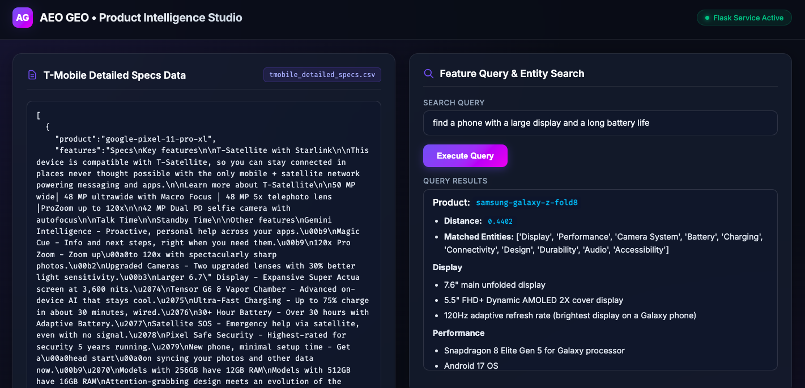

## How to Run
python app.py

## **Entity-Driven AEO/GEO Optimization Workflow**

1. **Entity Extraction**: Extract explicit **Product Entities** and **Feature/Specification Entities** directly from raw product descriptions.
2. **Knowledge Graph Construction**: Map relationships between **Product Entities** and their associated **Feature/Specification Entities** to form a structured knowledge graph.
3. **Entity-Based Feature Querying**:
* Extract target query entities from user search prompts.
* Traverse the **Knowledge Graph** using matching entities to retrieve candidate **Product Entities**.
* Compare candidate product profiles against the query to identify the most semantically similar product.

4. **Generative Engine Optimization (GEO) Alignment**:
Select a benchmark **Source Product** and a **Target Product** to align the Target Product’s content profile with the high-ranking Source Product.
* **4.1 Baseline Similarity**: Compute the semantic similarity between the **Source Product Specifications** and **Target Product Specifications**.
* **4.2 Specification Mapping**: Define new **Target Product Specifications** derived from high-value **Source Product Specifications**.
* **4.3 Entity Rephrasing**: Rephrase the updated **Target Product Specifications** using precise noun phrasing and clear entity formatting.
* **4.4 Similarity Re-evaluation**: Calculate the updated semantic similarity score between the **Source Product Specifications** and the newly optimized **Target Product Specifications**.
* **4.5 Content Generation**: If the similarity score improves, rewrite the complete **Target Product Description** incorporating the optimized specification entities.
